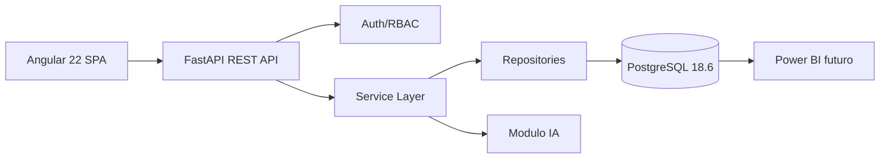
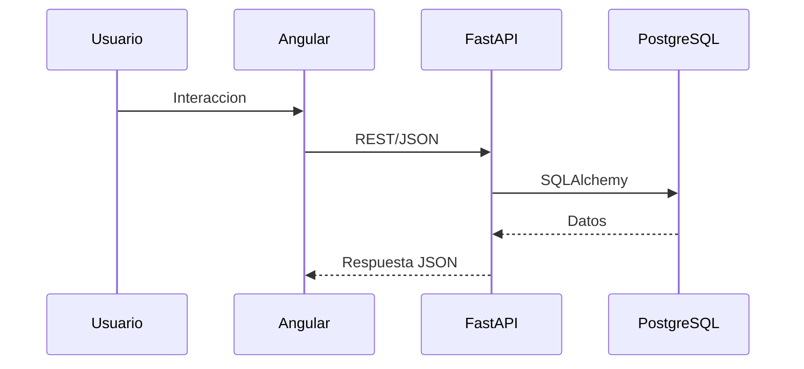

# Arquitectura

Paideia usa una arquitectura modular simple para 12 semanas de desarrollo academico.

## Frontend

SPA Angular con standalone components, Router, lazy loading, HttpClient, guards, interceptor JWT, componentes reutilizables y paginas placeholder. Angular Material se deja como decision futura si el equipo requiere acelerar UI.

## Backend

FastAPI expone `/api/v1`. La estructura separa endpoints, servicios, repositorios, schemas, modelos y modulos. La primera fase implementa solo health check y configuracion.

## Base de datos

PostgreSQL 18.6, SQLAlchemy 2, Alembic, UUID donde corresponde, integridad referencial y timestamps timezone-aware. Modelo inicial: users, roles, students, academic_periods, grades, sections y courses.

## IA

La IA consumira servicios internos del backend. No accede desde frontend a la base de datos. La prediccion sera alerta temprana indicativa y requiere validacion pedagogica.

## BI

Power BI consumira datos preparados desde PostgreSQL o vistas analiticas futuras. No se versionan archivos binarios `.pbix`.

## Seguridad

JWT, RBAC, hashing Argon2 y dependencias FastAPI quedan preparados. No se almacenan contrasenas en texto plano.

## Docker

Compose define `postgres`, `backend` y `frontend`, red interna, healthchecks, volumen persistente y puertos configurables.

## Flujo de datos

## Decisiones

- Se mantiene monolito modular, sin microservicios, Kubernetes, Redis ni colas.
- Node.js se limita al runtime/herramientas del frontend.
- Se documentan tablas futuras sin crearlas todas en la primera fase.
- PostgreSQL 18.6 y Python 3.14.7 se declaran segun requerimiento; si la disponibilidad de imagenes/herramientas cambia, se ajustara sin cambiar la arquitectura.

## Fases posteriores

CRUD, autenticacion completa, importacion transaccional, reportes, dashboards e IA entrenada se implementaran mediante historias de usuario.
