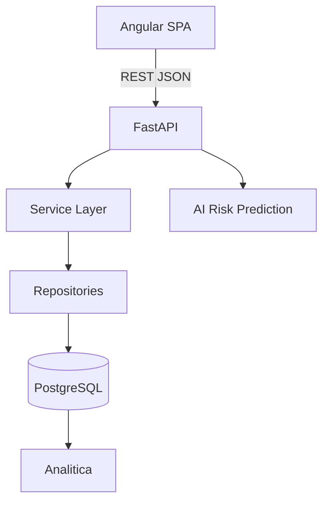

# Paideia

Plataforma inteligente para el seguimiento y prevencion del riesgo academico de estudiantes de la IE Paideia Newton, Trujillo, La Libertad, Peru.

## Problema

La institucion gestiona informacion academica en hojas Excel dispersas. La consolidacion, analisis y seguimiento requieren trabajo manual.

## Objetivo

Centralizar datos academicos y convertirlos en informacion util mediante un sistema transaccional, analitica, inteligencia de negocio e IA como alerta temprana.

## Alcance

Incluye base para gestion academica, notas, asistencia, seguimiento, analitica, IA, reportes e importacion Excel/CSV. No es un ERP escolar completo.

## Arquitectura



## Stack tecnologico

| Capa | Tecnologia |
| --- | --- |
| Frontend | Angular 22, TypeScript, Vitest |
| Backend | Python 3.14.7, FastAPI 0.141, Pydantic 2, SQLAlchemy 2 |
| Datos | PostgreSQL 18.6, Alembic |
| IA | Pandas, NumPy, scikit-learn |
| Infraestructura | Docker, Docker Compose |

## Modulos

Autenticacion, usuarios, estudiantes, gestion academica, calificaciones, asistencia, seguimiento, BI, IA, reportes e importacion.

## Estructura del repositorio

```text
backend/   FastAPI, SQLAlchemy, Alembic y tests
frontend/  Angular SPA y componentes base
database/  SQL inicial, seeds y backups excluidos
ml/        estructura de IA sin modelos entrenados
bi/        SQL, datasets y KPIs de analitica de negocio
docs/      requisitos, arquitectura, Scrum, IA y analitica de negocio
```

## Requisitos previos

Git, Docker Desktop, VS Code. Node.js es opcional para desarrollo Angular local; Angular 22 requiere Node.js 22.22.3+, 24.15.0+ o 26+. Python solo es necesario si se ejecuta el backend fuera de Docker.

## Configuracion

Copiar `.env.example` a `.env` y ajustar valores locales. No versionar `.env`.

## Ejecucion con Docker

```bash
docker compose up --build
```

## URLs

- Frontend: http://localhost:4200
- Backend: http://localhost:8000
- Swagger: http://localhost:8000/docs

## Testing

```bash
cd backend && pytest
cd frontend && npm test -- --run
```

## Scrum

El desarrollo se ejecutara por sprints, tomando el backlog documentado como punto de partida para refinamiento.

## Seguridad

No incluir datos reales, documentos, backups, Excel/CSV reales, contrasenas, JWT ni secretos.
